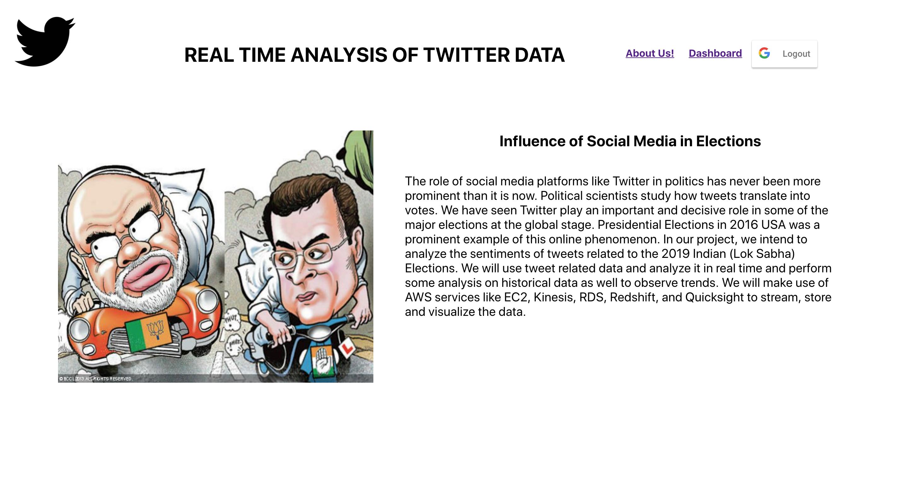
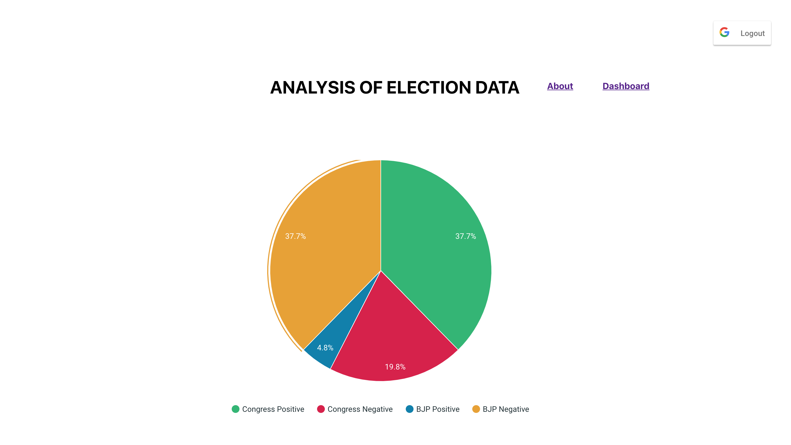
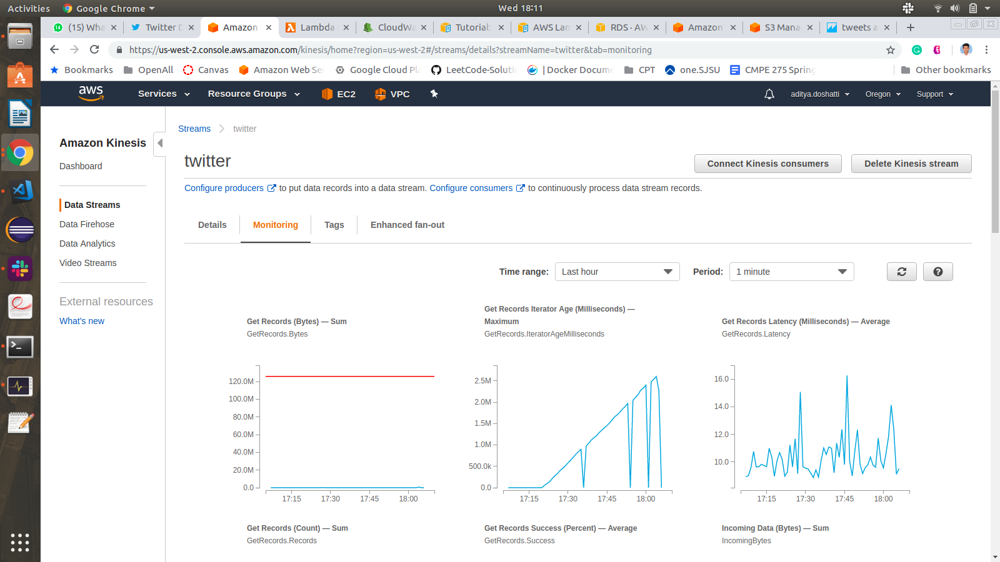

# Real-Time-Analysis-of-Twitter-Data

## [San Jose State University](http://www.sjsu.edu/)

## [Big Data Engineering and Analytics](http://info.sjsu.edu/web-dbgen/catalog/courses/CMPE266.html)

##### Under the guidance of
### [Sanjay Garje](https://www.linkedin.com/in/sanjaygarje/)

##### Team Members
### [Aditya Doshatti](https://www.linkedin.com/in/aditya-doshatti)
### [Dharma Dheeraj Chintala](https://www.linkedin.com/in/dharmadheeraj-chintala/)
### [Nishtha Atrey](https://www.linkedin.com/in/nishthaatrey/)
### [Rajat Dineshchandra Chaurasia](https://www.linkedin.com/in/chaurasiar/)
### [M S Srinivas](https://linkedin.com/in/mssrinivasbhargav/)

#### Introduction

The role of social media platforms like Twitter in politics has never been more prominent than it is now. Political scientists study how tweets translate into votes. We have seen Twitter play an important and decisive role in some of the major elections at the global stage. Presidential Elections in 2016 USA was a prominent example of this online phenomenon.
In our project, we intend to analyze the sentiments of tweets related to the 2019 Indian (Lok Sabha) Elections. We will use tweet related data and analyze it in real time and perform some analysis on historical data as well to observe trends. We will make use of AWS services like EC2, Kinesis, RDS, Redshift, and Quicksight to stream, store and visualize the data.

#### Demo Screenshots

#### Pre-requisites Set Up
* Must have the AWS Access Key and Secret Key of AWS Account to be used to create the setup.
* Must get access to the twiiter APIs by creating an APP in twitter.
* Must create the RDS Database cluster to which real time data stream is to be saved
* No need to create any configuration before, Delivery pipeline creation redirects to create Redshift cluster and S3 Buckets
* No need of any software locally, EC2 instance is server which has everything required

#### How to set up and kick-off project from developer sandbox?

Launch a AMI Linux EC2 instance, Copy the code files and execute files to create stream and load data into stream
